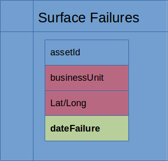
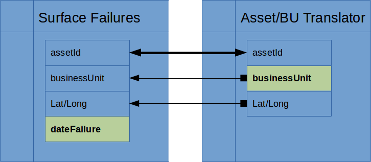
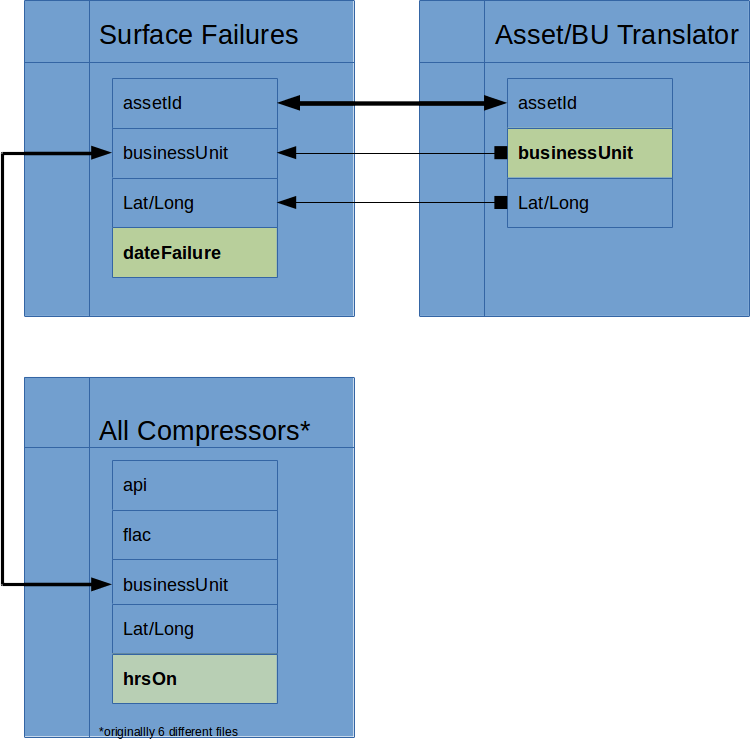
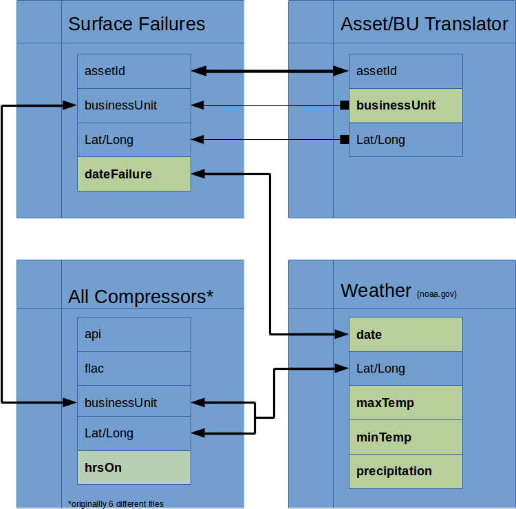
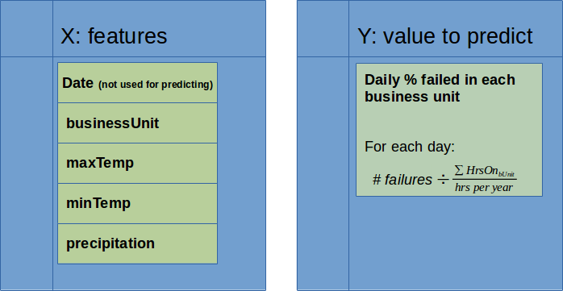
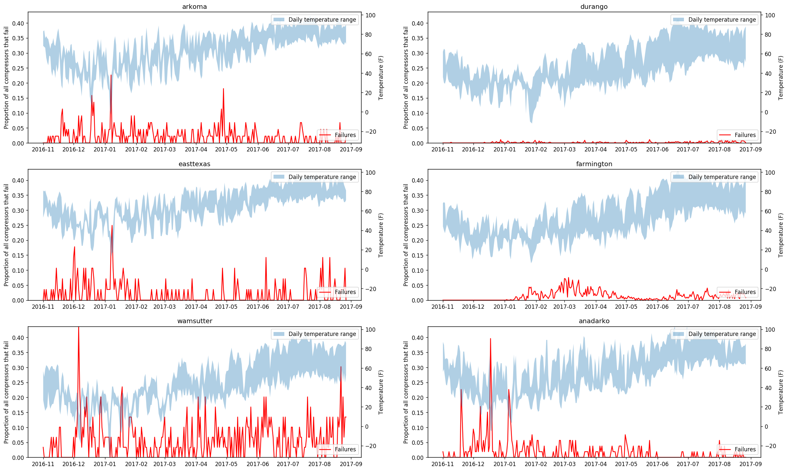
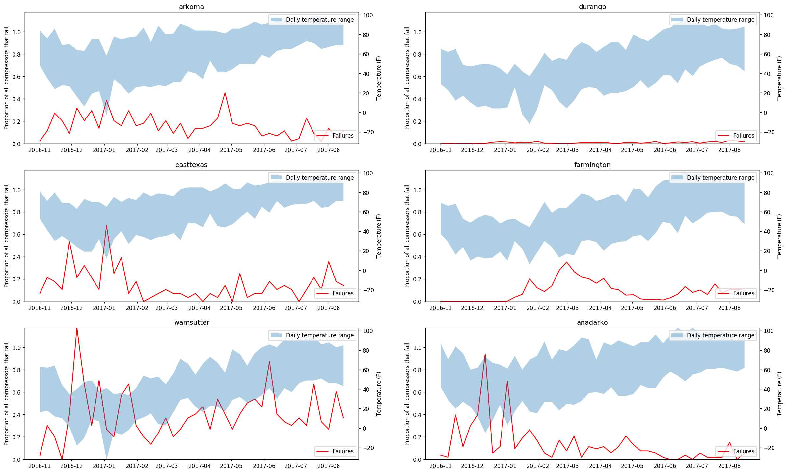
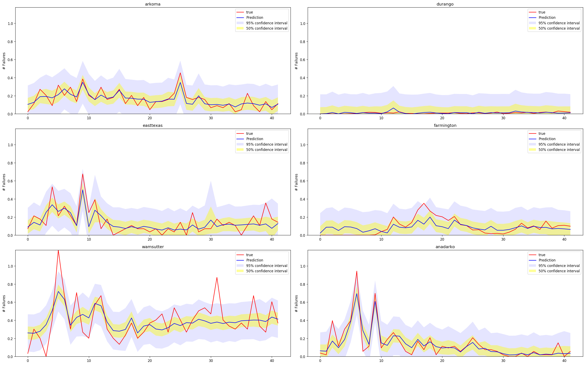
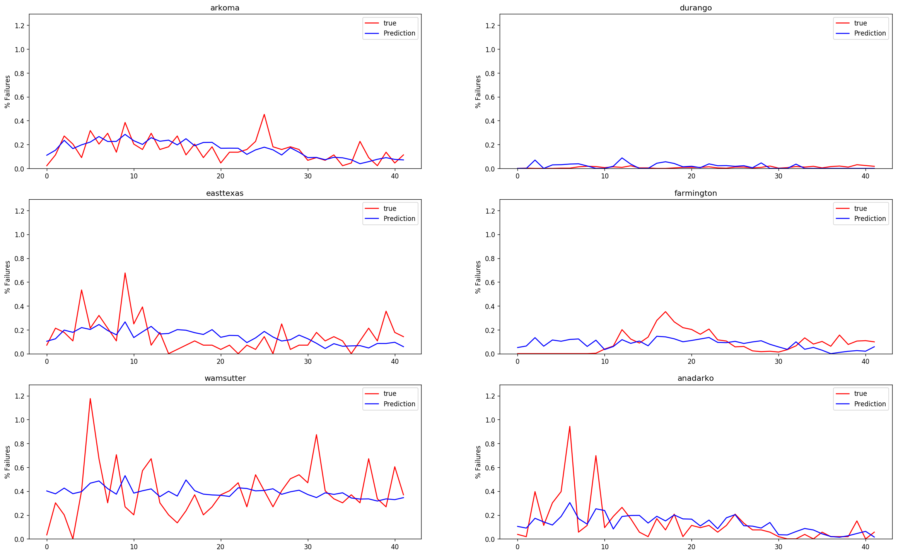
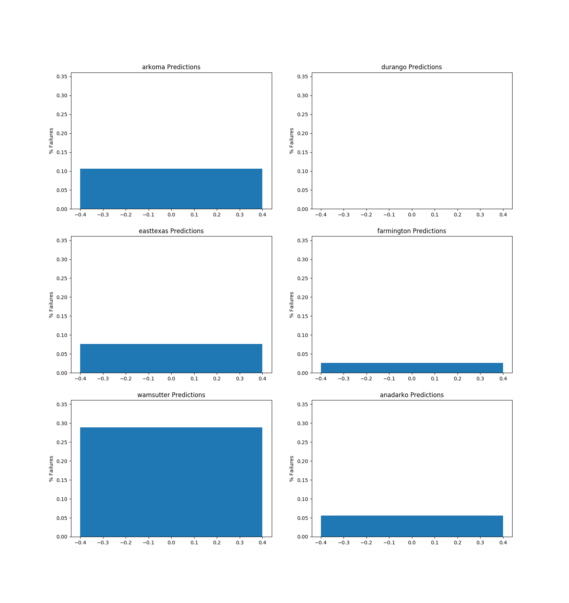

# If It Ain't Broke, Fix It?
**Given data on compressor failures, how can the tools of a Data Scientist improve the system?**

Gas and Oil wells have many moving parts, and a compressor is often central to the system.  They're used for everything from fracking to moving oil through a pipeline, and vary greatly in size and complexity.  Regardless of use case, it's a major problem when they break.

Knowledge about why compressors fail is often very localized; a mechanic in Wyoming doesn't often speak with a peer in Texas.  Data about the failures is equally isolated, with regions that don't compare notes about their hardware.  By combining information from all of the regions and incorporating relevant weather data, it will be easier to discover information about the particulars affecting each region and provide insight into the relative performance of compressors across the US.

Further, using the forecasted weather will provide estimates on future compressor failures with the aim of improving uptime and stabilizing the flow of gas and oil from the well.

# Creating the Dataset
**Goal: Know how many compressors failed in each business unit every day.**

### Surface Failures
The initial data is a history of logged compressor failures.  
  
However, the Lat/Long coordinates are wildly innacurate, likely from a mobile device.  The businessUnit is also unreliable, as it is tied to the users account who put in the record and not the location of the asset itself.

### Correcting SF Errors
Thankfully, there exists a master record of assetIds and their Lat/Lon and businessUnit.  That file gets used to overwrite the erroneous data from the Surface Failure log.  
  

### Creating the 'Not Failed' set
Knowing what has failed is relatively useless unless you also know what **hasn't** failed.  To get this data, there were EPA required reports that counted how many compressor-hours were logged in each business unit over the last year.  From this, we can calculate the percentage of compressors that failed in each business unit every day.  
  

### Adding Weather Features
Now we can add additional features about each location and day.  Noaa.gov has an API which provides access to historical and future weather information based on lat/lon coordinates.  Since weather is only recorded at specific weather stations, the geographic center of the business unit was used to find the closes relevant weather station.  
  

### A Usable Dataset
Combining all that together, there now exists a target y (failures/business unit) which can be predicted based on some features X (weather).  
  

Here is what it looks like over time, broken down by business unit.


To smooth out the noise and make predictions more useful, failures were summed into one-week increments.


# Predicting the Future
While there are many models which may perform well, there are a few factors that dictate the most appropriate direction:
* Given such a small feature space, overfitting would be exceptionally bad.  Prefer a simper model.
* The utility of the model will come from its explanatory ability.  Prefer a simpler model.
* Given time series data, we would prefer a model that can account for it.  However, we are limited by only having less than a full year of information.

After exploring many different models, Linear Regression and Gaussian Process Regressors best fulfilled all of the needs with reasonable explained variances.

|          | GaussianProcess | n^2 LinearRegression | LinearRegression |
| -------- | --------------- | -------------------- | ---------------- |
| **R<sup>2</sup>**  | 0.61^            | 0.51             | 0.45 |
| **MAE**  | 0.07^            | 0.09             | 0.10 |
| **RMSE** | 0.12^            | 0.13             | 0.14 |
^These results are questionable and need to be looked at again

## Gaussian Process Regressor
Gaussian Processes work well with time series data, as they fit a distribution to the data over time.  In addition to performing a prediction (the mean value of the distribution at a given point), this type of model also provides a confidence interval around that data point.

One of the parameters for this non-parametric model is a kernel.  A kernel is compiled of different distributions to represent the effect prior data points has on the posterior prediction.  In this case, a Rational Quadratic kernel was combined with a White Noise kernel.

Rational Quadratic kernels are:
```
 "...a scale mixture of squared exponential kernels with different length scales.
 This gives variations with a range of time-scales, the distribution peaking around
λ but extending to significantly longer period (but remaining rather smooth)"  
(http://www.robots.ox.ac.uk/~sjrob/Pubs/philTransA_2012.pdf)
```

In practice, here is how it performs against our entire data set.


```python
kernel = RationalQuadratic() + 0.1 * WhiteKernel()

model = GaussianProcessRegressor(kernel=kernel, n_restarts_optimizer=10)
```

## Linear Regression

### Coefficients for all terms, as a percentage of the total sum of |coefficients|.

| Coefficient | Value |
| ----------- | ----- |
| X_intercept (anadarko) | 24.39% |  
| maxTemp | 16.40% |
| avgTemp | -18.52% |
| minTemp | -4.93% |
| precip | 1.33% |
| elevation | 0.33% |
| arkoma | 5.07% |
| durango | -6.81% |
| easttexas | 5.20% |
| farmington | -1.09% |
| wamsutter | 15.92% |


## Polynomial (n^2) Linear Regression
^Replace this graph  

### Coefficients for terms worth > 1% of all coefs  

| Coefficient | Value |
| ----------- | ----- |
| X_intercept (anadarko) | -14.57% |  
| durango | -3.53% |  
| farmington | -2.81% |  
| easttexas | -2.54% |  
| wamsutter | -1.58% |  
| elevation | -1.77% |  
| elevation^2 | -5.96% |  
| arkoma^2 | 4.11% |  
| durango^2 | 5.37% |  
| farmington^2 | 5.81% |  
| easttexas^2 | 6.25% |  
| wamsutter^2 | 6.50% |  
| elevation * farmington | -2.50% |  
| elevation * wamsutter | -2.21% |  
| elevation * arkoma | 1.35% |  
| elevation * durango | 2.90% |  
| elevation * easttexas | 4.78% |  
| arkoma * wamsutter | 1.07% |  
| durango * easttexas | 1.15% |  
| durango * farmington | 1.88% |  
| arkoma * farmington | 2.41% |  
| arkoma * durango | 3.34% |  
| farmington * wamsutter | 3.83% |  
| durango * wamsutter | 4.38% |  

## Observations
There are some peaks in the data which the models seem to struggle to predict.  These failures are likely due to factors unaccounted for by just the weather and location.  Further feature engineering may prove fruitful in putting a signal to that noise.

# What's the weather like?
Predicted failures for next week (10/3 - 10/10) using Gaussian Process Regressor.

| Location | Predicted Failure Rate |
| - | - |
| arkoma |     10.7% |
| durango |    00.0% |
| easttexas |  07.5% |
| farmington | 02.7% |
| wamsutter |  28.9% |
| anadarko |   05.6% |

^Ugly graph, replace


## Really bad assumptions
* The date that the failure was recorded was the same as the date of the failure
* The weather at the general business unit station is indicative of the weather for all compressors in the business unit
* The number of compressors in each business unit is constant throughout the year
* Different compressors are similarly affected by weather
* Weather is the only factor affecting compressor failures
* Summarizing the data by Business Unit is the best way to predict and view results

## Breaking the model
* LinearRegression assumes:
  * no colinearity: max/min temps are highly correlated
  * the signal is linearly related to the features: <0% or >100% failures are impossible
  * homoscedasticity: extreme temperatures seem to have more variance
* Gaussian Processes assumes an underlying repeatable distribution: trained on <1 full period of data
* Gaussian Processes works with time series data: the distribution of failures through time makes it tough to make a meaningful test/train
* Lots of training data is needed: weekly totals have 252 data points

# Improvements
1. Reassess with multiple years of data, enabling a more accurate Gaussian Process
1. Refactor the code into PyMC3 with Gaussian Process
  * Allows for a multilevel model with modifications for each business unit
  * Allows for more inspection of the relative importance of the features
1. Add more features pertinent to compressor failures
  * Fractional distribution of manufacturers
  * Proportion of well types
1. Predict failures on a per-compressor level, as opposed to business unit wide.  Look at much more relevant features
  * Time between maintenance


# About Me
https://www.linkedin.com/in/bdoremus/

As a Data Scientist with a degree in Electrical and Computer Engineer and 10 years of experience teaching, I bring a unique skill set to any Data Science team. Combining my strong technical background in software and mathematics with the daily experiences I had leading a classroom, I have a proven ability to communicate with all stakeholders, be they technically adept or focused on other fields. My hobbies tend to inform my work in interesting ways, be it through music, microcontrollers, or woodcraft.

# Obligatory Cat Picture
